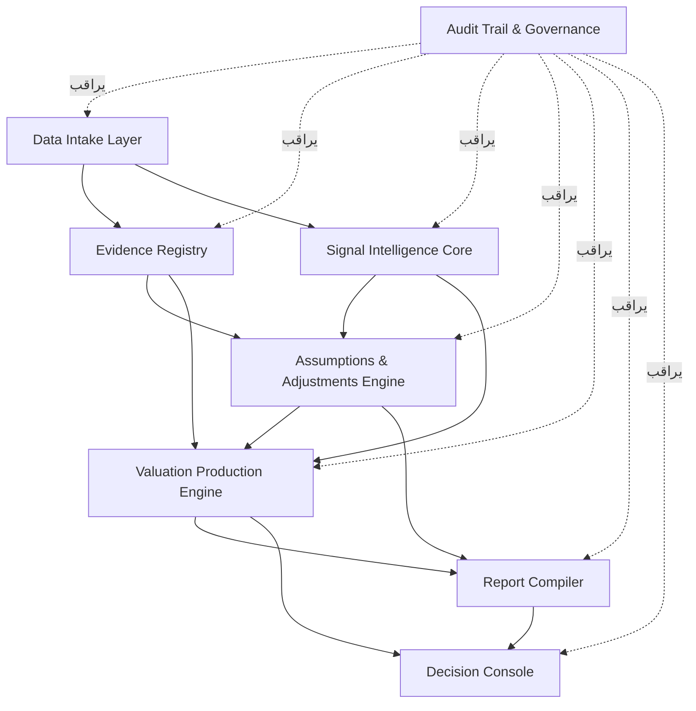

# خطة إعادة هيكلة HVOS (Hemmah Valuation Operating System)

**نوع الوثيقة:** خطة برنامج تنفيذية (Program Plan) — قابلة للتدقيق
**النطاق:** توحيد محفظة مشاريع Lovable و Replit في نظام تشغيل تقييم واحد
**تاريخ الإصدار:** 2026-06-04
**مالك الوثيقة:** مدير البرنامج (Program Manager)
**الحالة:** مسودة v1.0 للاعتماد

> هذه الخطة مبنية على وثيقة المعمارية والاعتمادية وترشيد المحفظة (Architecture + Dependency Map + Portfolio Rationalization). الافتراض أنه لا توجد خطة تفصيلية سابقة، وأن الهدف هو الانطلاق خلال **4–8 أسابيع** ثم التوسّع.

---

## ملخص تنفيذي (Executive Summary)

القرار الحاكم: **لا نبني مشاريع أكثر — نبني نظامًا واحدًا**. تتحول 30+ تجربة متفرقة إلى نظام طبقي واحد (HVOS) داخل Monorepo، تحكمه قاعدة واحدة: أي مكوّن لا يضيف بيانات موثقة، أو منطق تقييم قابلًا للاختبار، أو مخرجًا مهنيًا قابلًا للمراجعة — لا يدخل النظام.

- **4 مشاريع** تدخل التطوير الفوري (نواة فئة A).
- **7+ مشاريع** تُدمج كوظائف داخل طبقات (فئة B).
- **الباقي** يُجمّد (C) أو يُؤرشف (D) بعد استخراج الدروس.
- **الفجوة الحرجة:** بناء **Assumptions & Adjustments Engine** + **Audit Trail** من اليوم الأول.
- **النواة:** Valuation Signal Intelligence — **الواجهة:** Signal Compass — **الأدلة:** Comparable Sales Analyzer — **الإنتاج:** Property Valuer Pro.

---

## 1) النطاق والحوكمة (Scope & Governance)

### 1.1 حدود HVOS — ما يدخل وما يخرج

| الفئة | القرار | المشاريع | معيار الدخول/الخروج |
|---|---|---|---|
| **A — تطوير فوري** | يبدأ الآن داخل النظام | Valuation Signal Intelligence، Signal Compass، Comparable Sales Analyzer، Property Valuer Pro | صلة مباشرة بالتقييم + قابلية تدقيق + وجود منطق/تشغيل |
| **B — دمج موجّه** | يدمج كوظيفة لا كمنتج | Valuation Copilot، Valuation Navigator، MacroSignal Engine، Valuation Weaver، العقل العقاري الذكي، Landfill Report Pro، HVOS Operational Foundation | قيمة محتملة لكن تطويرها مستقلًا يزيد التداخل |
| **C — تجميد** | لا يبدأ الآن؛ يُراجع عند حاجة من النواة | Real Estate Audit، Template Manager، Realty Template Master، Market Pulse Monitor، Trend Compass، OpenAVM Kit، Land Value Lens، Property Insights، valuation-intake-analyzer | لا حاجة إنتاجية واضحة بعد |
| **D — أرشفة/حذف** | يُؤرشف لاستخراج مكوّن أو فكرة فقط | بوتات Telegram، تجارب UI (Pixel Perfect، Dream Home، Project Canvas…)، Data Nexus/Weaver/Uploader، PDF Analyzer، Report Replicator، Foundation Framework | لا يضيف أصلًا برمجيًا تراكميًا |

**حدود واضحة (Boundaries):**
- **داخل النطاق:** المعمارية الطبقية السبع، عقود البيانات، المحركان المفقودان، الـ Monorepo، الحوكمة.
- **خارج النطاق (الآن):** أي منتج مستقل جديد، أي Copilot عام، أي أداة تقارير منفصلة، أي تطوير إنتاجي مباشر في Lovable.

### 1.2 الأدوار وحقوق القرار (RACI مختصر)

| الدور | المسؤولية | حق القرار |
|---|---|---|
| **Program Sponsor (صاحب القرار)** | تمويل، أولويات، إيقاف/استمرار | القرار النهائي على النطاق والميزانية |
| **Program Manager (PM)** | الجدول، المخاطر، الحوكمة، التقارير | اعتماد المراحل والبوابات (Gates) |
| **Architecture Owner** | المعمارية، ADRs، عقود البيانات | اعتماد القرارات المعمارية |
| **Valuation Lead (خبير تقييم)** | منطق التقييم، الافتراضات، معايير الجودة المهنية | اعتماد منطق التقييم والمعايير |
| **Tech Lead** | الترحيل، الكود، الاختبارات، CI/CD | اعتماد دمج الكود (merge) |
| **Compliance/Audit Owner** | Audit Trail، الامتثال، التتبع | اعتماد قابلية التدقيق |
| **Product/UX Owner** | Decision Console، تجربة المستخدم | اعتماد واجهة القرار |

> في فريق صغير قد يجمع شخص واحد عدة أدوار، لكن **حقوق القرار تبقى منفصلة منطقيًا** لتجنب تضارب المصالح بين السرعة والجودة.

### 1.3 إيقاع الحوكمة (Governance Cadence)

| الاجتماع | التكرار | الهدف | المخرج |
|---|---|---|---|
| Daily Standup | يومي (15 د) | عوائق وتقدّم | سجل عوائق محدّث |
| Stage Gate Review | نهاية كل مرحلة | قرار المرور/التوقف | محضر بوابة + قرار موثق |
| Architecture Board | أسبوعي | مراجعة ADRs والعقود | ADR معتمد/مرفوض |
| Risk & Compliance Review | أسبوعي | المخاطر والامتثال | سجل مخاطر محدّث |
| Steering Committee | كل أسبوعين | الأولويات والميزانية | قرارات تنفيذية |

**قاعدة البوابات (Gate Rule):** لا تنتقل أي مرحلة إلى التالية دون مخرج قابل للتدقيق (ADR، schema، اختبار ناجح، أو تقرير).

---

## 2) المعمارية ونموذج البيانات (Architecture & Data Model)

### 2.1 المعمارية عالية المستوى



| الطبقة | الوظيفة | المصدر الأول | لينياج البيانات (Data Lineage) |
|---|---|---|---|
| Data Intake | استقبال العقار/الملفات/المقارنات | valuation-intake-analyzer | مصدر → عقد `property` |
| Evidence Registry | أدلة ومقارنات بمصدر ودرجة ثقة | Comparable Sales Analyzer | مدخل → عقد `comparable` (مع reliability_score) |
| Signal Intelligence | إشارات السوق والمخاطر | Valuation Signal Intelligence | إشارة → عقد `market-signal` |
| Assumptions & Adjustments | الافتراضات والتعديلات والحساسية | **يُبنى الآن** | أدلة+إشارات → `assumption`/`adjustment` |
| Valuation Production | تنفيذ منطق التقييم | Property Valuer Pro | الكل → `valuation-case` |
| Report Compiler | تقارير وقوالب قابلة للتدقيق | طبقة موحّدة | `valuation-case` → تقرير |
| Audit Trail | تسجيل كل قرار/تعديل/مصدر | مشترك من اليوم الأول | كل تغيير → `audit-event` |

### 2.2 معايير التقييم الموحّدة والمقاييس وسجل التدقيق

**مبادئ موحّدة:**
1. كل قيمة أو تعديل يرتبط بمصدر أو افتراض (لا false precision).
2. كل افتراض له: أساس (basis)، درجة ثقة (confidence)، ورابط حساسية (sensitivity_link).
3. كل قرار يُسجّل في Audit Trail بـ (من، متى، ماذا، قبل/بعد، لماذا).
4. الأدلة تحمل دائمًا درجة ثقة وسبب القبول/الاستبعاد.

**نموذج البيانات (Data Model Sketch) — عقود JSON:**

| العقد | الحقول الأساسية |
|---|---|
| `property.schema.json` | property_id, asset_type, location, land_area, building_area, tenure, use, condition |
| `comparable.schema.json` | comparable_id, source, date, price, area, unit_rate, location_score, reliability_score, inclusion_decision |
| `market-signal.schema.json` | signal_id, signal_type, direction, strength, source, effective_date, valuation_implication |
| `assumption.schema.json` | assumption_id, category, statement, basis, confidence_level, affected_method, sensitivity_link |
| `adjustment.schema.json` | adjustment_id, comparable_id, factor, direction, amount_or_range, rationale, evidence_reference |
| `valuation-case.schema.json` | case_id, property_id, purpose, basis_of_value, valuation_date, methods_used, final_range, audit_status |
| `audit-event.schema.json` | event_id, actor, timestamp, entity_type, entity_id, action, before_after, rationale |

> العقود تُعرّف **قبل** أي واجهة أو ترحيل إنتاجي — هذا يمنع "الواجهات الجميلة بلا مصدر بيانات".

---

## 3) خارطة الطريق والمعالم (Roadmap & Milestones)

### المرحلة 0 — التهيئة (الأسبوع 1)
- إنشاء Monorepo `hvos-decision-intelligence` بهيكل apps/services/packages/data-contracts/docs/tests/archive.
- ADR-001 (Git مصدر الحقيقة)، ADR-002 (Monorepo واحد)، ADR-003 (لا Mock في الإنتاج)، ADR-004 (Audit Trail إلزامي).
- **معيار النجاح:** README معماري + 4 ADRs معتمدة + CI أساسي يعمل.

### المرحلة 1 — الاكتشاف والعقود (الأسبوعان 2–3)
- جرد المحفظة وتثبيت تصنيف A/B/C/D رسميًا.
- تعريف عقود البيانات السبعة + validation rules.
- ترحيل Valuation Signal Intelligence كأول service مع smoke test.
- **معيار النجاح:** schemas موثّقة + خدمة signal-intelligence تمر باختبار دخان.

### المرحلة 2 — التصميم والمحرك المفقود (الأسبوعان 4–5) — **هذا قلب الـ MVP**
- ترحيل Comparable Sales Analyzer كـ Evidence Registry.
- بناء النسخة الأولى من Assumptions & Adjustments Engine.
- **معيار النجاح:** سجل أدلة فعلي + سجل افتراضات/تعديلات مرتبط بمصدر.

### المرحلة 3 — الطيار/Pilot (الأسبوعان 6–7)
- ترحيل Signal Compass كـ Decision Console بعد إزالة Mock Data وربطه بالعقود.
- فحص Property Valuer Pro وربطه بالنواة (أو قرار إعادة بناء).
- تشغيل حالة تقييم واحدة End-to-End على عقار حقيقي.
- **معيار النجاح:** حالة تقييم واحدة تمر من المدخل حتى Decision Console مع Audit Trail.

### المرحلة 4 — التوسّع/Full Migration (الأسبوع 8 وما بعده)
- بناء Report Compiler الأولي + أرشفة فئة D + إغلاق المحفظة (Portfolio Closure).
- دمج فئة B تدريجيًا (Copilot، Navigator، Weaver…).
- **معيار النجاح:** تقرير قابل للتدقيق يُنتَج من النظام + archive index موثّق.

| المرحلة | الأفق | المخرج القابل للتدقيق | أهم خطر | التخفيف |
|---|---|---|---|---|
| 0 التهيئة | أسبوع 1 | Monorepo + ADRs | تشتت المستودعات | فرض Monorepo + ADR-002 |
| 1 الاكتشاف | أسابيع 2–3 | عقود + نواة إشارات | عقود غير ناضجة | مراجعة Architecture Board |
| 2 التصميم | أسابيع 4–5 | Evidence + Assumptions Engine | بناء واجهة قبل المنطق | تسلسل صارم (منطق أولًا) |
| 3 الطيار | أسابيع 6–7 | حالة E2E | بيانات Mock تتسرب | ADR-003 + بوابة جودة |
| 4 التوسّع | أسبوع 8+ | تقرير + أرشفة | عودة مقبرة MVPs | قواعد الحوكمة (قسم 5) |

---

## 4) إدارة التغيير والتبنّي (Change Management & Adoption)

### 4.1 خطة التواصل مع أصحاب المصلحة

| الجمهور | الرسالة | القناة | التكرار |
|---|---|---|---|
| Sponsor/الإدارة | لماذا نظام واحد بدل 30 مشروعًا؟ القيمة والمخاطر | عرض تنفيذي + لوحة KPI | كل أسبوعين |
| فريق التطوير | المعمارية الجديدة، العقود، قواعد الدمج | ورشة + ADRs + Monorepo README | عند كل مرحلة |
| خبراء التقييم | كيف يُحفظ الرأي المهني وقابلية الدفاع | جلسة عمل على Assumptions Engine | أسبوعي خلال م2–3 |
| المستخدم النهائي | كيف يتغير سير العمل اليومي | Decision Console demo + دليل | قبل الطيار |

### 4.2 التدريب ودعم الانتقال
- **ورش عملية:** عقود البيانات، استخدام Audit Trail، Decision Console.
- **أدلة قصيرة:** "كيف تضيف دليلًا"، "كيف توثّق افتراضًا"، "كيف تقرأ الحساسية".
- **فترة دعم مكثّف** (office hours) خلال الطيار.

### 4.3 تحليل أثر التغيير

| المتأثر | التغيير | الأثر | إجراء |
|---|---|---|---|
| سير عمل المقيّم | من أدوات متفرقة إلى نظام واحد | منحنى تعلّم + مقاومة | تدريب + إبراز توفير الوقت |
| فرق التطوير | Git مصدر الحقيقة، لا إنتاج من Lovable | تغيير عادات | قواعد واضحة + CI gates |
| التقارير | قوالب موحّدة بدل متفرقة | إعادة بناء قوالب | Report Compiler تدريجي |
| الإدارة | حوكمة وبوابات | شفافية أعلى | لوحة KPI |

---

## 5) الامتثال وقابلية التدقيق (Compliance & Auditability)

| المتطلب | التطبيق |
|---|---|
| **التتبع (Traceability)** | كل قيمة → افتراض/مصدر؛ كل افتراض → دليل؛ كل قرار → audit-event |
| **سجل المراجعة** | `audit-event.schema.json` إلزامي لكل تغيير (actor, timestamp, before_after, rationale) |
| **فحوص الامتثال** | validation-rules تمنع: قيمة بلا مصدر، افتراض بلا أساس، تقرير بلا audit |
| **معايير التوثيق** | ADR لكل قرار معماري + توثيق العقود + Portfolio Rationalization موثّق |
| **منع false precision** | نطاقات حساسية إلزامية في Valuation Engine |
| **الفصل بين البيئات** | لا Mock في الإنتاج (ADR-003)؛ Lovable للـ UX فقط |

**قاعدة ذهبية:** لا تقرير بلا Audit Trail، ولا قيمة بلا مصدر، ولا مشروع في Git بلا Data Contract.

---

## 6) خطة الموارد والقيود (Resource Plan & Constraints)

### 6.1 الجهد وتكوين الفريق (Minimal Viable Team)

| الدور | تفرّغ مقترح (MVP) | المرحلة |
|---|---|---|
| Program Manager | 50% | كل المراحل |
| Architecture/Tech Lead | 100% | كل المراحل |
| مطوّر Backend (services/packages) | 100% | م1–4 |
| مطوّر Frontend (Decision Console) | 50%→100% | م3–4 |
| Valuation Lead (خبير) | 30–50% | م2–3 خصوصًا |
| Compliance/Audit | 20% | كل المراحل |

> النواة قابلة للإنجاز بفريق **3–5 أشخاص**. التوسّع (فئة B) يحتاج طاقة إضافية بعد الأسبوع 8.

### 6.2 نطاقات الميزانية (تقديرية، تُعدّل حسب السوق)

| البند | MVP (8 أسابيع) | ملاحظة |
|---|---|---|
| فريق التطوير | الكتلة الأكبر من التكلفة | حسب الأجور المحلية/التعاقد |
| اشتراكات الأدوات (Lovable/Replit/Git/CI) | منخفض–متوسط | اشتراكات قائمة غالبًا |
| استشارة تقييم مهني | متوسط | لاعتماد منطق التقييم |
| احتياطي مخاطر (15–20%) | متغير | لتغطية إعادة بناء Property Valuer Pro |

### 6.3 إدارة الاعتماديات (Dependency Management)
- **حرج:** عقود البيانات قبل المحركات؛ Evidence + Signals + Assumptions قبل Valuation Engine؛ Audit Trail من اليوم الأول.
- **مسار حرج:** Signal Intelligence → Evidence Registry → Assumptions Engine → Valuation Production → Report → Console.
- **خطر تبعية:** Property Valuer Pro قد يحتاج إعادة بناء (احتفظ ببديل).

---

## 7) مقاييس النجاح (Success Metrics / KPIs)

### كمّية
| KPI | الهدف |
|---|---|
| عدد المنتجات النهائية | من 30+ إلى **1 نظام** متعدد الوحدات |
| تغطية عقود البيانات | 100% من الوحدات النشطة |
| نسبة القيم المرتبطة بمصدر/افتراض | ≥ 95% |
| تغطية Audit Trail | 100% من القرارات |
| زمن إنتاج حالة تقييم E2E | ↓ مقارنة بالوضع الحالي |
| مشاريع مؤرشفة (C+D) | تنفيذ كامل حسب التصنيف |
| نجاح الاختبارات (smoke/unit/valuation-logic) | ≥ 90% خط أخضر |

### نوعية
| KPI | المؤشر |
|---|---|
| قابلية الدفاع المهني | كل تقرير يجيب: "لماذا هذه القيمة؟" |
| رضا المستخدم/المقيّم | استبيان بعد الطيار |
| نضج الحوكمة | لا قرار معماري بلا ADR |
| منع عودة المقبرة | صفر مشاريع جديدة خارج النظام |

---

## 8) قوائم تحقق (Checklists)

### بوابة الدخول لأي مشروع إلى HVOS
- [ ] يضيف بيانات موثقة أو منطقًا أو مخرجًا مهنيًا قابلًا للمراجعة
- [ ] له Data Contract معرّف
- [ ] الطبقة المستهدفة محددة (لا منتج مستقل)
- [ ] يدخل عبر Git (لا إنتاج مباشر من Lovable)
- [ ] مربوط بـ Audit Trail

### قائمة تحقق المرحلة 0
- [ ] Monorepo منشأ بالهيكل الكامل
- [ ] ADR-001..004 معتمدة
- [ ] CI أساسي (lint + test) يعمل
- [ ] ميثاق الحوكمة معتمد

### قائمة تحقق إغلاق المحفظة
- [ ] فئة A قيد التطوير داخل النظام
- [ ] فئة B موثّقة كنقاط دمج
- [ ] فئة C مجمّدة بقرار موثق
- [ ] فئة D مؤرشفة + استخراج الدروس
- [ ] archive index منشور

---

## 9) عينات مصنّعات (Sample Artifacts)

### 9.1 مخطط ميثاق الحوكمة (Governance Charter Outline)
```
1. الغرض والرؤية (نظام واحد قابل للتدقيق)
2. النطاق (داخل/خارج) + تصنيف A/B/C/D
3. الأدوار وحقوق القرار (RACI)
4. إيقاع الحوكمة والبوابات (Stage Gates)
5. قواعد منع عودة مقبرة MVPs
6. معايير الامتثال والتدقيق
7. إدارة المخاطر والتصعيد
8. مقاييس النجاح والمراجعة الدورية
```

### 9.2 رسم نموذج البيانات (Data Model Sketch)
```
property ─1:N─ valuation-case ─N:M─ comparable
   │                  │
   │                  ├─ uses ─ assumption ─ links ─ sensitivity
   │                  ├─ uses ─ adjustment ─ ref ── comparable
   │                  └─ informed-by ─ market-signal
audit-event ── attaches-to ── (كل الكيانات أعلاه)
```

### 9.3 مصفوفة الترحيل (Migration Matrix)
| المشروع | الفئة | الطبقة الهدف | اتجاه Workflow | شرط الدخول | الحالة |
|---|---|---|---|---|---|
| Valuation Signal Intelligence | A | Signal Core | Replit→Git→Lovable | فحص كود + smoke test | مخطط |
| Signal Compass | A | Decision Console | Lovable→Git→Replit | إزالة Mock + عقود | مخطط |
| Comparable Sales Analyzer | A | Evidence Registry | Replit→Git | comparable schema | مخطط |
| Property Valuer Pro | A | Valuation Production | Replit→Git | فصل المنطق عن الواجهة | مخطط |
| Valuation Copilot/Navigator/Weaver | B | Production/Console/Report | عبر Git | وظيفة محددة | مؤجل |
| تقارير/قوالب متعددة | C | Report Compiler | — | بعد توحيد الطبقة | مجمّد |
| Telegram/UI experiments | D | — | — | استخراج مكوّن فقط | أرشفة |

---

## 10) الخطة الدنيا القابلة للتطبيق (MVP — انطلاق خلال 4–8 أسابيع)

**الأسابيع 1–2:** Monorepo + ADRs + عقود البيانات + ترحيل Signal Intelligence (نواة).
**الأسابيع 3–5:** Evidence Registry + **Assumptions & Adjustments Engine** (الفجوة الحرجة) + Audit Trail مشترك.
**الأسابيع 6–8:** Decision Console (Signal Compass نظيف) + فحص Property Valuer Pro + حالة E2E واحدة + Report أولي + أرشفة D.

**المخرج بعد 8 أسابيع:** نظام واحد يُنتج حالة تقييم قابلة للتدقيق من المدخل حتى التقرير، مع سجل أدلة وافتراضات وتدقيق.

**تحسينات قابلة للتوسّع (بعد MVP):** دمج فئة B تدريجيًا، توسيع مناهج التقييم، تحسين NLP/OCR في طبقة المدخلات، طبقة عربية مهنية (العقل العقاري الذكي)، توسيع القوالب في Report Compiler.

---

## 11) القيود وكيفية التكيّف (Constraints & Adaptation)

| نوع القيد | الأثر المحتمل | التكيّف |
|---|---|---|
| **الجدول الزمني** | فريق صغير قد لا ينجز كل فئة A في 8 أسابيع | تثبيت النواة (Signal + Evidence + Assumptions + Audit) كحد أدنى؛ تأجيل Property Valuer Pro لإعادة بناء إن لزم |
| **تنظيمي/امتثال** | معايير تقييم مهنية (مثل المعايير الدولية/المحلية) | إشراك Valuation Lead + Compliance مبكرًا؛ Audit Trail يغطي متطلبات التتبع |
| **الأدوات (Tooling)** | اعتماد Lovable/Replit قد يقيّد الإنتاج | Git مصدر الحقيقة؛ Lovable للـ UX فقط؛ Replit للتشغيل عبر Git |
| **جودة الكود القديم** | Property Valuer Pro قد يكون غير قابل لإعادة الاستخدام | بوابة فحص كود؛ قرار "ترحيل أو إعادة بناء" موثق في ADR |
| **بيانات Mock** | تسرّبها يفسد الموثوقية | ADR-003 + validation-rules تمنعها في الإنتاج |

**نقاط تحتاج تأكيدك (Open Questions):**
1. ما المعايير التنظيمية للتقييم الواجب الالتزام بها (دولية/محلية)؟ تؤثر على Audit Trail والتقارير.
2. حجم الفريق والميزانية الفعلية — تحدد إن كانت فئة A كاملة ممكنة في 8 أسابيع.
3. هل Property Valuer Pro سيُرحّل أم يُعاد بناؤه؟ يحتاج فحص كود أولًا.
4. اشتراكات Lovable/Replit/CI الحالية — لتقدير دقيق للتكلفة.

> في غياب إجابات قاطعة الآن، الخطة تعتمد افتراضات محافظة: فريق 3–5، نواة أولًا، وإعادة بناء كخيار احتياطي لـ Property Valuer Pro.
